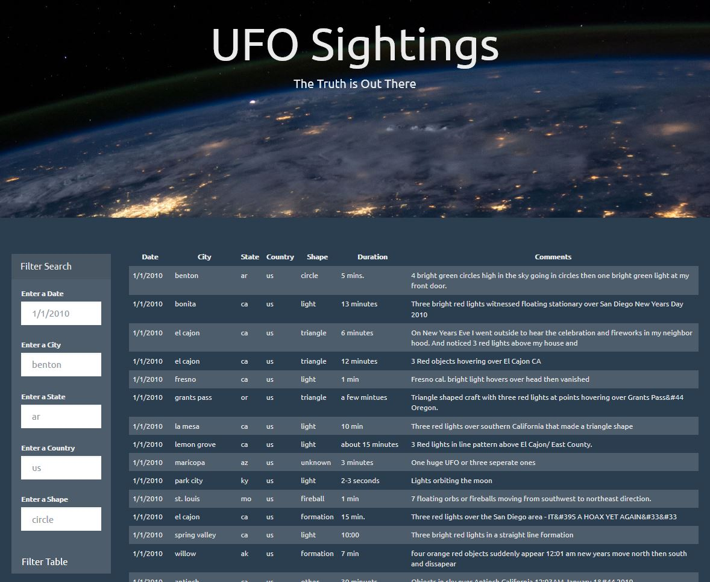
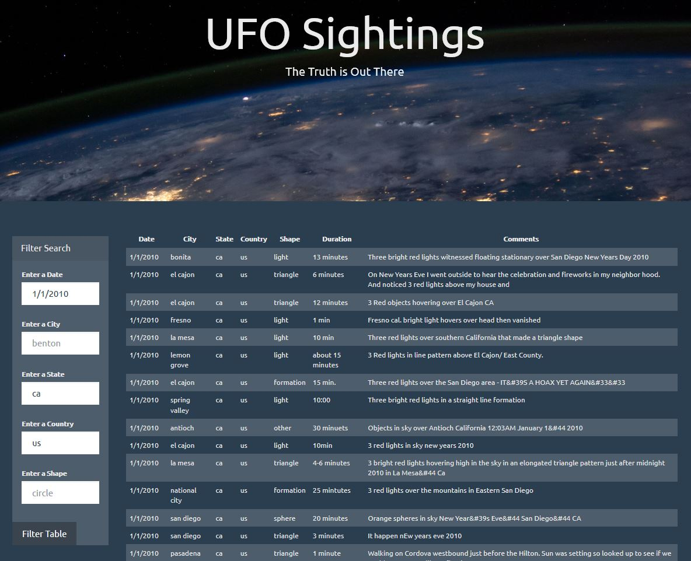
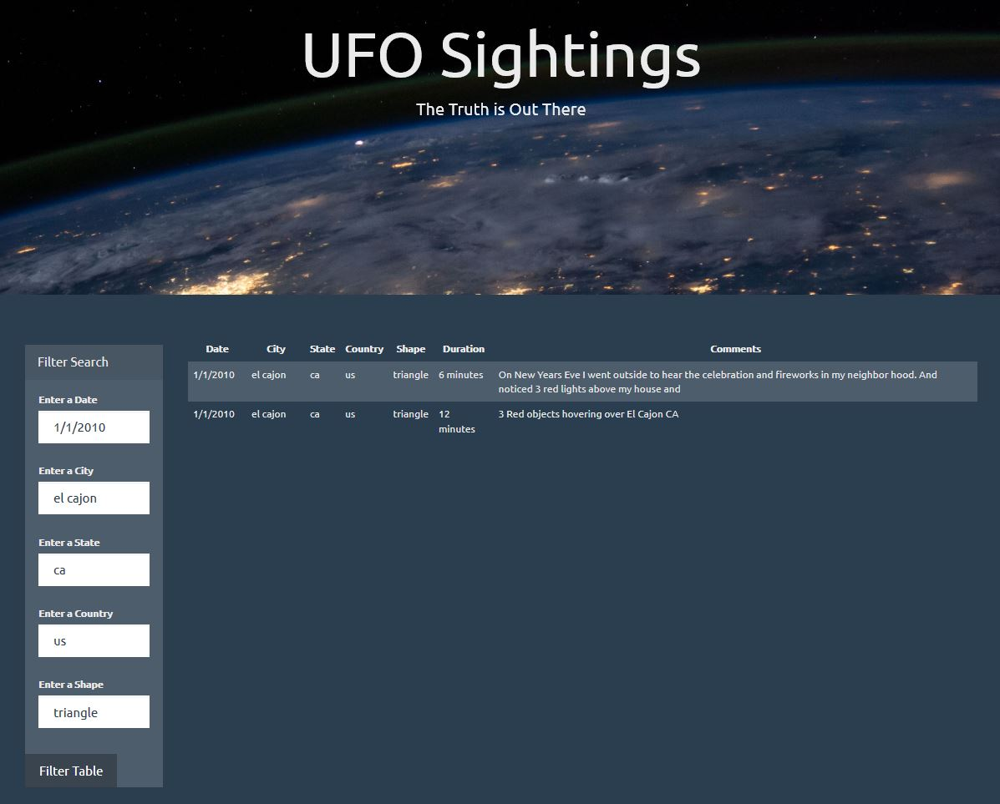

# Aliens-R-Real

## **Objective:**
The objective of this project is to use JavaScript to append a UFO sightings dataset, originally stored in an array of JavaScript objects, as a table to a webpage. Multiple input fields and an event handler are added to allow users to filter the displayed data by UFO sighting date, city, state, country, and shape.

## **Tools:**
1. JavaScript
2. HTML/CSS

## **Screenshots:**
No filters

Select filters (date, state, country)

All filters

